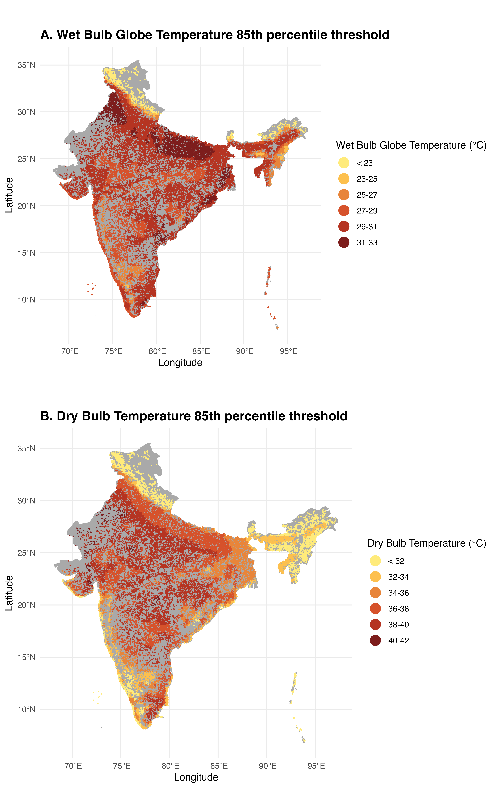
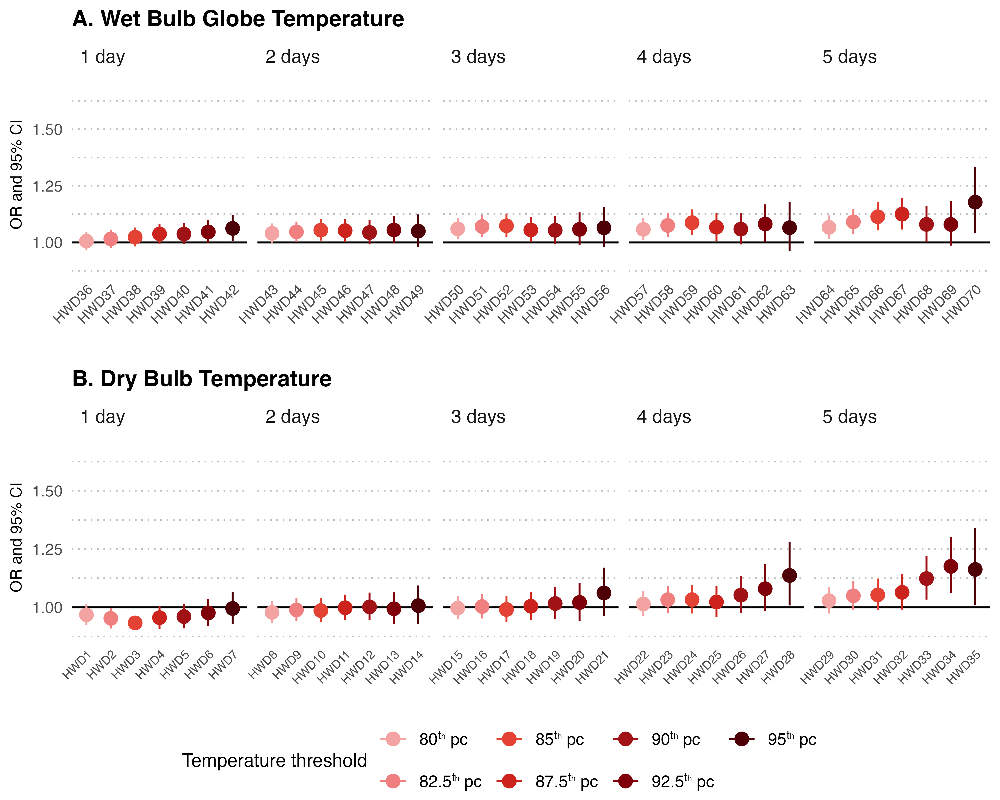
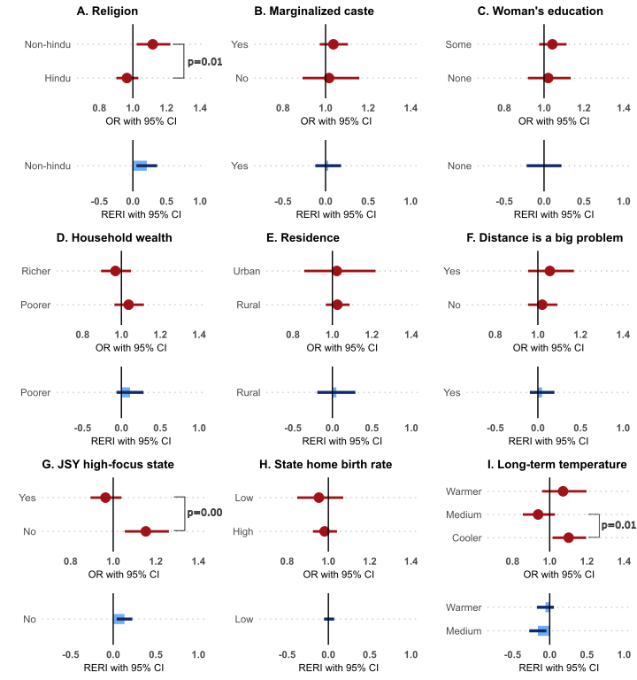

# Heatwaves and home Births: Understanding the impact of extreme heat on place of delivery in India

Authors: Arnab K. Dey, Anna Dimitrova, Anita Raj, Tarik Benmarhnia

This repository contains the scripts used to study the effect of extreme heat on home deliveries in India. The following sections describe the data sources used in the study and the scripts needed to replicate the analysis. 

# Data Sources
Raw data for Wet Bulb Globe Temperature (WBGT) and Dry Bulb temperatures can be obtained directly using the links below. Data on place of delivery, date of birth, and other individual level socio-economic and demographic variables can be obtained from the Demographic and Health Survey (DHS) website by creating an account and submitting an application to use the data.

* WBGT-Max: (https://zenodo.org/records/8021197)
* Dry-bulb temperature: (https://cds.climate.copernicus.eu/datasets/derived-era5-single-levels-daily-statistics?tab=overview)
* DHS dataset (https://www.dhsprogram.com/data/available-datasets.cfm)

# Setting up project paths

1. **Modify `path_example.R` and rename it to `paths.R`**  
   Replace the placeholder paths in `path_example.R` with your local directory structure:  
   ```r
   # Update these paths to match your local setup
   path_project <- "/your/local/project/directory"  # Root directory of your project
   dhs_temp_dir <- "path/to/your/dhs-and-temperature-datasets/"    # Directory containing DHS and temperature datasets 
   ```
2. The script assumes the processed data for analysis with merged data from DHS and temperature variables is  named  `df_dhs_temperature_merged.rds` and is saved under: `path_project/data/processed_data/`

3. Update dhs_temp_dir in path_example.R to point to your local copies of:

- DHS datasets (e.g., IAIR7EDT/, IAGE7AFL/)
- Temperature datasets (e.g., wbgt-max/, tmax/)

# Results

## Spatial distribution of 85th percentile thresholds for WBGT and Dry-bulb maximum temperatures


## Odds Ratios and 95% CIs from the full models 


## Odds Ratios and RERI (95% CIs) from effect modification analysis 


